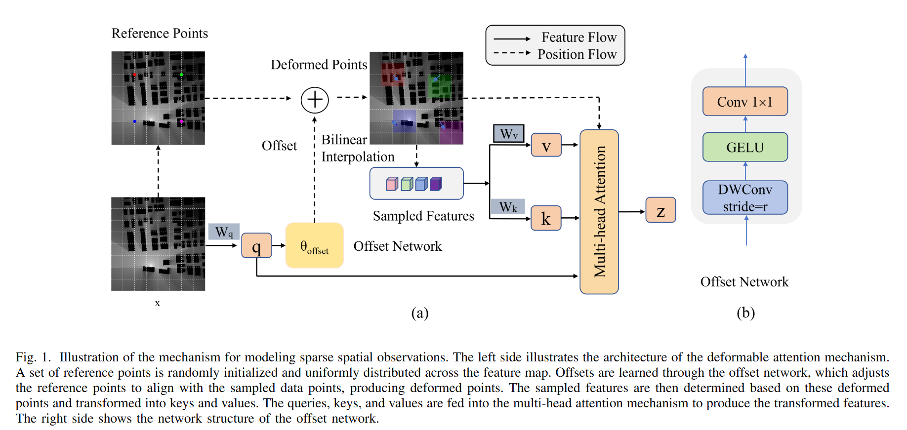
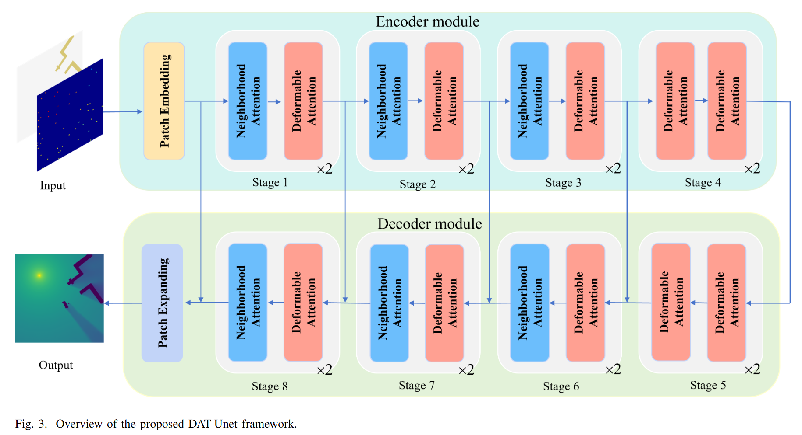

# Paying Deformable Attention to Sparse Spatial Observations for Deep Radio Map Estimation
[](https://www.comsoc.org/publications/journals/ieee-tccn)

This is the official implementation of DAT-Unet, titled as  "Paying Deformable Attention to Sparse Spatial Observations for Deep Radio Map Estimation" .


**Source:**《[Paying Deformable Attention to Sparse Spatial Observations for Deep Radio Map Estimation](https://ieeexplore.ieee.org/abstract/document/11176936)》

### Deformable Attention

This work explores a deformable Transformer-based approach for radio map estimation. This novel method overcomes the limitations of traditional attention mechanisms and, to some extent, addresses the challenges of complex and dynamically changing scenarios in radio map estimation.




### DAT-Unet model
To meet the demand for a general yet robust RME architecture capable of handling varying levels of sparsity, it is essential to not only consider the spatial relationships between observations but also the dynamic nature of signal propagation across diverse environments. Our proposed method, DAT-Unet, leverages deformable attention mechanisms and multi-scale contextual fusion to overcome the limitations of existing approaches. These innovations enable the model to adaptively capture both local and global signal interactions, improving performance in scenarios characterized by extreme sparsity and complex propagation patterns. 



## Preparation

### Python Environment Config

```python
===== PyTorch Info =====
PyTorch version: 2.1.0+cu118
CUDA version: 11.8
```

Please run command `pip install -r requirements.txt` to install the supporting packages.

About the installation of natten, you may refer to [natten](https://github.com/SHI-Labs/natten) for more details.

## Training 

Run command ```python main.py``` to train your model and chose different dataset.

In the task of radio map estimation, the model performance is validated on two datasets, namely **[Radiomapseer](https://radiomapseer.github.io/index.html)** and **[SpectrumNet 5D](https://github.com/ShuhangZhang/FDRadiomap)**. 

### Sampling-based RME

When using RadioMapSeer dataset, you can run this script:

```python
from data.loaders import RadioUNetDataset
python main
--model_name unet
--data_name sear
--model_type DAT_UNet
--image_size 256 
--simulation DPM, IRT2, IRT4
```
More scripts can be found in the [scripts-datUnet-Seer](scripts-datUnet-Seer).

When using SpectrumNet dataset, you can run this script:

```python
from data.loaders_pcl_5d import RadioMap5DDataset
python main
--model_name unet
--model_type DAT_UNet
--data_name pp5d
--image_size 128
```
More scripts can be found in the [scripts-datUnet-PP5D](scripts-datUnet-PP5D).

### Sampling-free RME

If you want to construct the radio map solely from the building map and antenna position information,
you can run this script:

```python
from data.loaders import RadioUNetDataset
python main
--model_name unet_tx
--model_type DAT_UNet
--data_name sear
--image_size 256 
--simulation DPM
```
You can also use the file in the [scripts-datUnet-tx](scripts-datUnet-tx).


## BibTex Formatted Citation

If you find this repo useful, please cite:
```bibtex
@article{liu2025datunet,
  title={Paying Deformable Attention to Sparse Spatial Observations for Deep Radio Map Estimation},
  author={Kangjun Liu; Chunyan Qiu; Ke Chen; Qingfang Zheng; Lingyang Song; and Yaowei Wang},
  journal={IEEE Transactions on Cognitive Communications and Networking},
  year={2025},
  publisher={IEEE},
  doi={10.1109/TCCN.2025.3613520}
}
```
  

## Acknowledgement

We acknowledge the authors of the following repos:

https://github.com/GeoAICenter/RadioMapEstimation (Base code reference)

https://github.com/LeapLabTHU/DAT (DAT code reference)

https://radiomapseer.github.io/index.html (Radiomapseer dataset reference)

https://github.com/ShuhangZhang/FDRadiomap (Spectrum dataset reference)	

